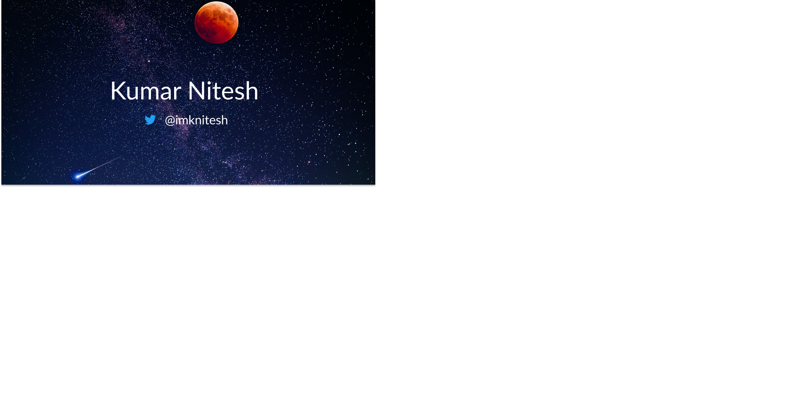

 

## 📚 About Me

🖥 &nbsp; Full-stack software developer \
⚡ &nbsp; part time Android Developer \
💬 &nbsp; Ask me about JavaScript, React, NodeJs, C#, .Net, Cloud! \
🔭 &nbsp; I regularly post on twitter related to programming \
📫 &nbsp; How to reach me: DM: @imKnitesh

##  What I'm up to

🔭 &nbsp; I'm currently working on multiple open source npm packages, social posting app and master in computer science.

 
  <strong>Visitors</strong>  
  

  <strong>Show some ❤️ by starring some of the repositories!</strong>

<!--
**knitesh/knitesh** is a ✨ _special_ ✨ repository because its `README.md` (this file) appears on your GitHub profile.

Here are some ideas to get you started:

- 🔭 I’m currently working on ...
- 🌱 I’m currently learning ...
- 👯 I’m looking to collaborate on ...
- 🤔 I’m looking for help with ...
- 💬 Ask me about ...
- 📫 How to reach me: ...
- 😄 Pronouns: ...
- ⚡ Fun fact: ...
-->

